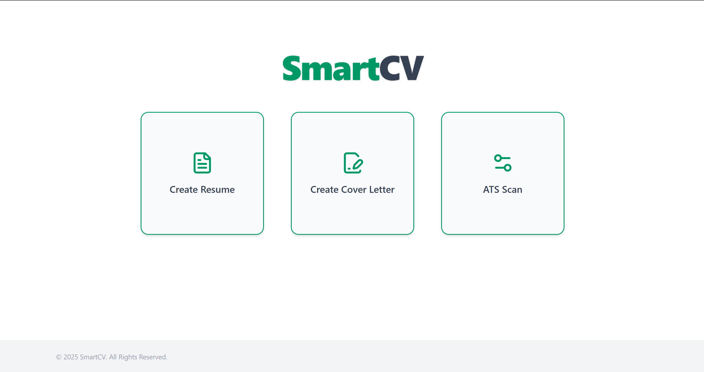
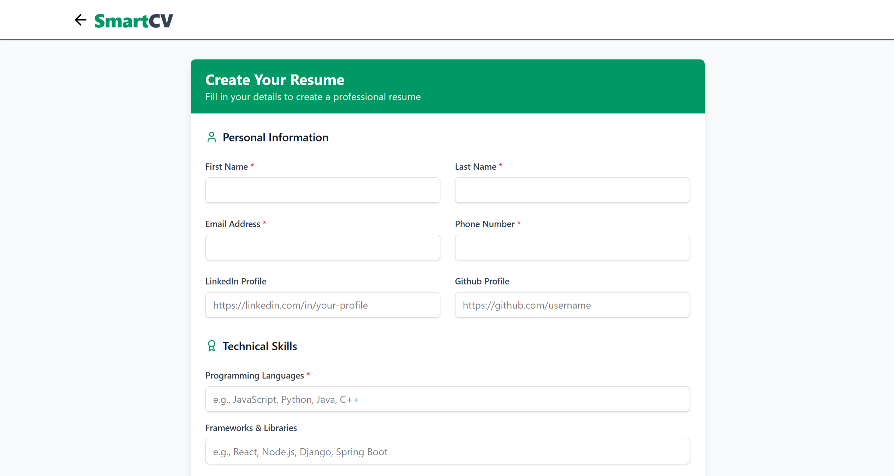
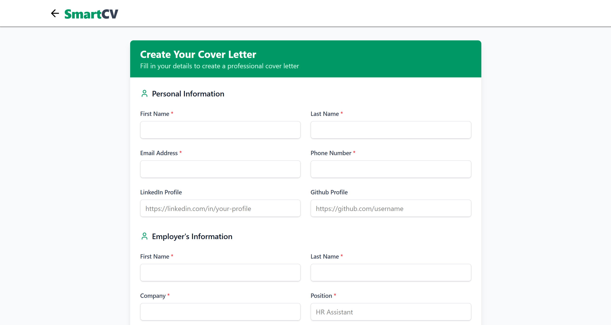
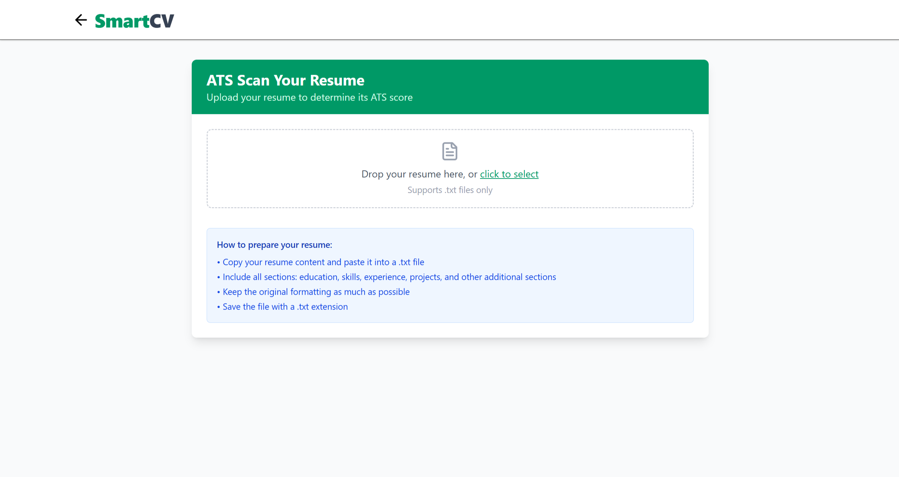

# 🧠 SmartCV

An AI-powered web app that helps you **create**, **tailor**, and **polish** your resume and cover letter for any job posting. Built with React, Node.js, Express.js, and the Gemini API, SmartCV makes job applications smarter and more personalized, increasing your chances of landing a job.

### 🌐 Deployment Notice:
The frontend is deployed on Vercel.
The backend is not hosted, so features requiring API requests will not function in the live demo.

Live Demo: [https://smart-cv-git-main-louis-nguyens-projects-7bf4fa77.vercel.app/](https://smart-cv-git-main-louis-nguyens-projects-7bf4fa77.vercel.app/)






---

## ✨ Features

- 📝 **Resume Builder**  
  Input your education, experience, skills, and instantly generate a professional resume in LaTeX.

- ✍️ **Cover Letter Generator**  
  Automatically create personalized cover letters based on your resume and a job description.

- 🎯 **ATS Scanner**  
  Scan your resume with an ATS scanner to check for important keywords and ensure it's formatted so computers can read it properly.

- 📄 **Downloadable PDFs**  
  Export your resume and cover letter in clean, ATS-friendly formats.

---

## 🚀 Tech Stack

### Frontend
- React.js
- Tailwind CSS

### Backend
- Node.js
- Express.js
- Gemini API
- File System module (fs)

---

## ⚙️ Getting Started Locally

### 1. Clone the repo
    ```bash
    git clone https://github.com/louisnguyenn/SmartCV.git
    cd SmartCV

### 2. Set up the backend
    cd server
    npm install
    npm run dev

### 3. Set up the frontend
    cd client
    npm install
    npm run dev

## 🔑 Environment Variables (refer to .env.example)
    ```server/.env
    GEMINI_API_KEY=your_gemini_api_key_here

## 📚 Credits
Created by Louis Nguyen  
